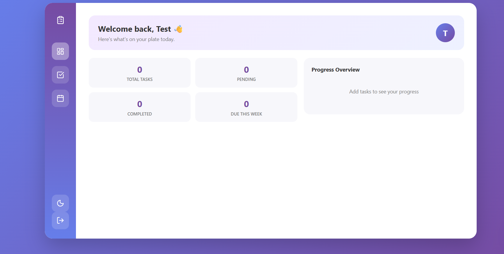

# 📋 Task Dashboard

A full-stack task management application with JWT authentication, real-time filtering, calendar visualization, and a polished, responsive UI — built as part of a full-stack development internship project.

**🔗 Live Demo:** [https://task-dashboard-dusky.vercel.app](https://task-dashboard-dusky.vercel.app)



---

## ✨ Features

### Core Functionality
- Full CRUD operations (Create, Read, Update, Delete) for tasks
- Task attributes: title, description, status, priority, category, due date
- One-click status toggling (pending ↔ completed)
- Inline task editing
- Confirm-before-delete modal to prevent accidental deletion

### Organization & Discovery
- Filter tasks by status (All / Pending / Completed)
- Sort by due date or priority
- Live search across title and description
- Task categories (Work, Health, Project, Household, Self Care, Other)
- Priority levels with color-coded badges (Low / Medium / High)
- Due date validation (no past dates allowed)

### Authentication & Security
- Secure signup with bcrypt password hashing
- JWT-based authentication with protected API routes
- Per-user data isolation — each user only sees their own tasks
- Ownership verification on update/delete operations
- Email format validation (frontend + backend)
- Persistent sessions via localStorage

### Dashboard & Visualization
- Multi-page app with client-side routing (Dashboard / Tasks / Calendar)
- Live stats overview (Total, Pending, Completed, Due This Week)
- Interactive donut chart showing task progress (Recharts)
- Calendar view with month navigation and color-coded due-date markers

### UI/UX
- Custom split-screen authentication page
- Dark mode with persisted preference
- Toast notifications for user actions
- Loading states and empty states
- Fully responsive design
- Custom-built dropdown and date picker components
- Lucide icon system throughout

---

## 🛠️ Tech Stack

**Frontend**
- React (Vite)
- React Router
- Recharts (data visualization)
- React Datepicker
- Lucide React (icons)
- Vanilla CSS with CSS custom properties (theming)

**Backend**
- Node.js + Express
- MongoDB with Mongoose
- JWT (jsonwebtoken) for authentication
- bcryptjs for password hashing

**Deployment**
- Frontend: Vercel
- Backend: Render
- Database: MongoDB Atlas

---

## 🏗️ Architecture

```
task-dashboard/
├── backend/
│   ├── models/          # Mongoose schemas (User, Task)
│   ├── routes/           # Express routes (auth, tasks)
│   ├── middleware/       # JWT authentication middleware
│   └── server.js
└── frontend/
    └── src/
        ├── pages/         # Route-level page components
        ├── components/    # Reusable UI components
        └── App.jsx        # Root component (state + logic)
```

The app follows a clear separation of concerns: `App.jsx` centralizes state and business logic, page components handle layout per route, and smaller presentational components (TaskForm, TaskItem, Sidebar, etc.) focus purely on rendering.

---

## 🚀 Running Locally

### Prerequisites
- Node.js
- MongoDB Atlas account (or local MongoDB instance)

### Backend Setup
```bash
cd backend
npm install
```

Create a `.env` file in `backend/`:
```
MONGO_URI=your_mongodb_connection_string
JWT_SECRET=your_random_secret_key
PORT=5000
FRONTEND_URL=http://localhost:5173
```

```bash
npm start
```

### Frontend Setup
```bash
cd frontend
npm install
```

Create a `.env` file in `frontend/`:
```
VITE_API_URL=http://localhost:5000
```

```bash
npm run dev
```

---

## 📌 API Endpoints

| Method | Endpoint | Description | Auth Required |
|--------|----------|--------------|----------------|
| POST | `/auth/signup` | Register a new user | No |
| POST | `/auth/login` | Log in and receive a JWT | No |
| GET | `/tasks` | Get all tasks for the logged-in user | Yes |
| POST | `/tasks` | Create a new task | Yes |
| PUT | `/tasks/:id` | Update a task | Yes |
| DELETE | `/tasks/:id` | Delete a task | Yes |

---

## 🎯 What I Learned

Building this project end-to-end deepened my understanding of:
- Designing and securing a REST API with JWT authentication
- Structuring a React application with clean component boundaries
- Managing complex state across a multi-page application
- Working with MongoDB schema design and relationships (referencing users in tasks)
- Deploying a full-stack app across separate hosting providers and configuring CORS for cross-origin communication
- Debugging real deployment issues (environment variables, CORS, build configuration)

---

## 📄 Author

Nayab Maryam
